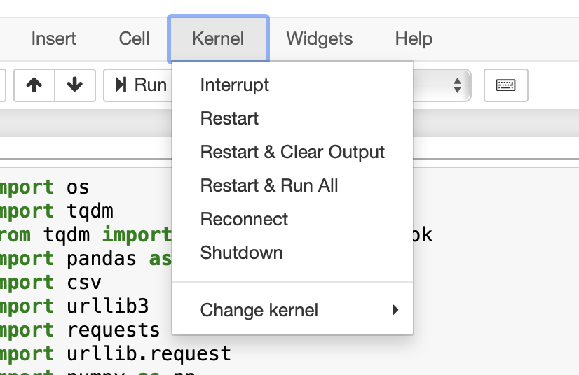
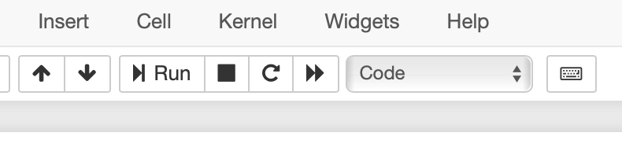

# Cloud computing environments to support data science teaching in health
## Description
Data science is a rapidly growing discipline with applications in many areas of science and society. One area in which it is growing rapidly is in health - particularly working with the data being captured in hospitals and doctors surgeries. As a result, we need to develop the capacity to train large numbers of professional health workers (doctors, nurses, administrators) in basic data science. To support this we need to explore the ways in which data science environments can be made available to a wide range of learners who may not be based at the university. This project will explore the use of Jupyter notebooks and cloud infrastructures to create learning resources for health data science.


## Prerequisites

Jupyter Notebook must be installed to run the notebooks.

The following libraries must be installed in order to run the notebooks.

* For LondonOpenData_ETL
```
import os
import shutil
import tqdm
import pandas as pd
import re
import csv
import urllib3
import requests
import urllib.request
import numpy as np
import time
import IPython
import urllib3
import boto3
import s3fs
import ipywidgets as widgets
```
* For Meta_Local_Data
```
import os
import pandas as pd
import numpy as np
import time 
import pwd
import re
import io
import nltk
import sys
import string
import plotly.graph_objects as go
import plotly.express as px
import seaborn as sns
import math
import plotly.graph_objects as go
import plotly.express as px
import warnings
import boto3
import s3fs
import ipywidgets as widgets
import tqdm 
import IPython
import scipy 
import sklearn
```
* For OpenPrescribing
```
import numpy as np
import pandas as pd
import plotly.graph_objects as go
import plotly.express as px
import re
import seaborn as sns
import random
import time
import io
import ipywidgets as widgets
```

* For Statistical analysis
```
import os
import pandas as pd
import numpy as np
import time 
import pwd
import re
import io
import nltk
import seaborn as sns
import pandas as pd
import ipywidgets as widgets
import sys
import string
import math
import plotly.graph_objects as go
import plotly.express as px
import warnings
import boto3
import s3fs
import math
import matplotlib.pyplot as plt
import seaborn as sns
import ipywidgets 
import scipy 
```

## Running the notebooks

* Click the "Restart & Clear output" button in order to restart the notebook and clear the output. 


* To run a cell, click the "Run" button.


* The output of each cell will appear under the current cell.

# London Open Data notebook

This notebook allows users to search the available data resources on the London Datastore and download them both locally and on the cloud storage. To access the cloud storage, the user needs to configure the credential file settings. 

### Tutorial on how to configure the AWS S3 CLI: [Link](https://docs.aws.amazon.com/cli/latest/userguide/cli-configure-files.html)

# Metadata notebook

This notebook allows users to generate metadata from a .csv file. Users can upload multiple files to get the metadata from them and upload the generated metadata file both on the local and cloud storage.

# OpenPrescribing notebook

This notebook allows users to extract useful information from the resource files on the OpenPrescribing website. 

# Data quality analysis notebook

This notebook allows users to get a better understanding of the resource quality.
